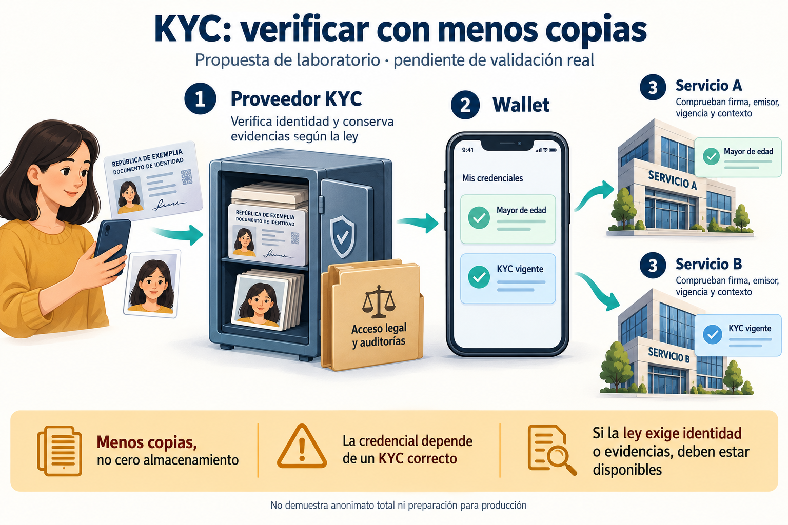

# KYC Minimal Disclosure Lab

Demostración educativa de minimización de datos KYC: un proveedor/emisor, una wallet y dos verificadores locales. **Solo laboratorio: KYC simulado, sin integración con proveedores reales y sin preparación para producción.**



La imagen es conceptual. En la demo, **ambos servicios** verifican mayoría de edad y KYC vigente.

## Actualización 0.2 — lecciones de integraciones

Se agregan dos mejoras pequeñas: interpretar decisiones sin aceptar estados
intermedios y reducir copias en observabilidad. **Los cuatro proveedores son
simulados; no hay cuentas, SDKs ni conexiones KYC reales.**

- `provider_profiles.py` proyecta subconjuntos documentados de Ripio, Sumsub,
  Truora y Veriff a un estado mínimo. Rechaza asociaciones incompatibles;
  respeta `override_status` y exige `completed + GREEN` donde corresponde.
- `decision_gate.py` consulta la fuente simulada en cada autorización. Una
  aprobación antigua, un evento atrasado o un proveedor inaccesible no conceden
  un permiso nuevo. Vincula audiencia, política, recurso y caducidad local.
- `privacy_audit.py` amplía la demo original: busca los canarios también en
  Base64, Base64URL y segmentos JWT, con límites de trabajo explícitos.
- `decision_log` permite únicamente eventos y valores previstos, sin cuerpos,
  credenciales, nombres ni texto de excepciones. Es la lección aplicable también
  a verificadores de credenciales; no se integra el backend de Extrimian.
- `reuse_options` rechaza la combinación que promete selfie nueva mientras se
  conserva el estado previo y el proveedor ignora esa exigencia.

[Contratos, fuentes y límites](docs/proveedores.md). No se copió código de
integraciones ajenas. La demo JWS original y el experimento de estados son
**dos experimentos separados**: esta versión no conecta un proveedor real con
la emisión de credenciales ni demuestra revocación entre organizaciones.

## Qué demuestra

- Documentos y datos ficticios se inyectan en la captura del proveedor.
- El emisor entrega constancias JWT/JWS diferentes por audiencia, vinculadas a claves holder distintas.
- A y B verifican firma, emisor, expiración, atributos, política, audiencia, nonce y contexto.
- SQLite conserva un recibo transaccional que permite recuperar una decisión después de perder su respuesta.
- El laboratorio inspecciona archivos controlados, logs, cache, backups y restauración para buscar marcadores documentales.

La captura ficticia **no verifica autenticidad documental, vida, rostro ni identidad humana**. Los atributos positivos son una fixture. El perfil JWT usa claims privados: no implementa SD-JWT VC ni conformidad OpenID4VCI/OpenID4VP.

## Ejecutar

Actualización probada en Linux con Python 3.12.14, PyJWT 2.10.1 y cryptography
46.0.0. El usuario también reportó una ejecución de esta actualización
(`03b88ab`) en Windows con PowerShell 7.6.6: 23 pruebas en 2,607 segundos,
resultado OK y ambas demos PASS. Es evidencia de consola aportada por el
usuario; no una ejecución Windows realizada por el asistente. La versión de
Python no aparece en ese transcript (la ejecución anterior usaba 3.11).
No se exige instalar Python 3.12 si ya existe un entorno 3.11. Dependencias
sin cambios, fijadas para reproducibilidad; no son una selección productiva.

En Windows PowerShell, para una instalación nueva:

```powershell
py -m venv .venv
.\.venv\Scripts\python.exe -m pip install -r requirements.txt
.\.venv\Scripts\python.exe -m unittest discover -v
.\.venv\Scripts\python.exe .\demo_minimizacion.py
.\.venv\Scripts\python.exe .\demo_proveedores.py
```

En Linux/macOS:

```bash
python -m venv .venv
source .venv/bin/activate
python -m pip install -r requirements.txt
python demo_minimizacion.py
python demo_proveedores.py
python -m unittest discover -v
```

Si ya usás el laboratorio en Windows, desde la carpeta del repositorio:

```powershell
git pull --ff-only origin main
.\.venv\Scripts\python.exe -m unittest discover -v
.\.venv\Scripts\python.exe .\demo_minimizacion.py
.\.venv\Scripts\python.exe .\demo_proveedores.py
```

En Windows esos comandos no necesitan activar el entorno. No hace falta
instalar Node.js ni configurar claves KYC.

Resultado esperado de la ejecución de referencia:

```text
PASS 18 archivos auditados; 21 controles JWS
PASS 18 controles de perfiles; 4 proveedores SIMULADOS
```

La suite tiene 23 pruebas, incluidas las cuatro regresiones previas de SQLite,
Windows y reporte de errores. Los 21 controles JWS se ejecutan dentro del flujo;
no deben sumarse a las 23 pruebas como si fueran ensayos independientes.

El script produce `resultado_minimizacion.json` en la carpeta del código. Los archivos inspeccionados y las claves de la fixture son temporales; el resultado conserva rutas, tamaños, hashes y detecciones. La ejecución publicada está en `results/resultado_minimizacion_20261007.json`.

El segundo script produce `resultado_proveedores.json`. Las evidencias de la
actualización están en `results/validacion_v02_20261007.json`,
`results/resultado_minimizacion_v02_20261007.json` y
`results/resultado_proveedores_v02_20261007.json`. La ejecución inicial se
conserva como antecedente; los tiempos locales no son benchmarks de proveedores.

La ejecución posterior de Windows está registrada por separado en
[`results/validacion_windows_v02_reportada_20261007.json`](results/validacion_windows_v02_reportada_20261007.json).
El manifiesto Linux original conserva el estado conocido al publicarse; su
campo de Windows pendiente queda complementado por esta evidencia posterior.
No se recibieron los JSON generados en Windows ni sus hashes.

Para ejecutar solo los controles criptográficos de componentes:

```bash
python reference_jws.py
```

## Archivos

| Archivo | Función |
| --- | --- |
| `demo_minimizacion.py` | Captura ficticia, dos presentaciones, auditoría y restore |
| `reference_jws.py` | Referencia de componentes JWS, binding y recibos |
| `demo_proveedores.py` | Dos servicios locales ante cambio de estado, evento atrasado y caída |
| `provider_profiles.py` | Interpretación de cuatro subconjuntos de contratos documentados |
| `decision_gate.py` | Lectura por autorización, caducidad y logs mínimos |
| `privacy_audit.py` | Detección acotada de canarios literales y codificados |
| `lab_fixtures.py` | Fuente y notificaciones simuladas, sin autenticación real |
| `test_provider_controls.py` | Casos adversariales de contratos, vigencia y privacidad |
| `docs/proveedores.md` | Capacidades existentes que reutilizar y límites del experimento |
| `PCN_Minimo_Educativo.html` | Explicación y matriz para abrir localmente |
| `matriz_minimizacion.json` | Propuesta de datos y responsabilidades, sin aceptación del integrador |
| `results/resultado_minimizacion_20261007.json` | Evidencia sintética de una ejecución |
| `docs/kyc-minimal-disclosure.png` | Ilustración conceptual generada con IA |

## Límites y resultados negativos

- **Una clave de emisor robada y todavía confiada puede emitir afirmaciones falsas aceptadas.** Una de las pruebas PASS reproduce deliberadamente ese contraejemplo; PASS no significa que el riesgo esté resuelto.
- La autoridad y sus cambios de clave son fixtures en memoria. No hay custodia independiente ni recuperación productiva de autoridad o wallet.
- Los dos verificadores se ejecutan en el mismo proceso, con bases separadas. No son organizaciones independientes desplegadas.
- El emisor puede correlacionar las constancias. Diferentes claves por servicio no demuestran anonimato total.
- La ausencia de canarios en 18 archivos no demuestra ausencia de datos personales en general. Se inspeccionan bytes literales y candidatos textuales Base64/Base64URL hasta tres niveles, incluidos segmentos JWT. No se cubren compresión, cifrado, OCR, valores fragmentados, otras codificaciones, memoria, red ni sistemas externos. Alcanzar un límite impide aprobar la auditoría acotada.
- Los normalizadores no autentican al proveedor. `Snapshot` y el resultado de autenticación de notificaciones son fixtures confiadas dentro del proceso. Una lectura reciente no garantiza que el backend remoto haya actualizado su estado ni que el KYC humano sea reciente o correcto.
- El permiso del segundo experimento es local y sintético. No acredita edad, AML ni autorización de transferencias. No contiene un ejecutor transaccional ni resuelve concurrencia distribuida o la ventana entre consultar y actuar.
- Volver a consultar reduce la dependencia de una caché positiva en el modelo, pero añade disponibilidad, latencia, costo y posibilidad de correlación por parte del proveedor. Esos efectos todavía no se midieron en una API real.
- La respuesta perdida se simula **después del commit**. El caso de respuesta del proveedor perdida antes del commit sigue pendiente.
- Se restaura un recibo SQLite. No se prueba recuperación integral ante rollback adversarial, pérdida de todas las réplicas ni eliminación física de backups.
- La comparación de tres ubicaciones documentales convencionales frente a una es un modelo sintético, no una medición de un integrador real.
- Si una entidad obligada debe identificar al cliente o conservar/acceder a evidencias, estas afirmaciones no la eximen.

## Próximo experimento

Acordar con un integrador qué datos necesita, para qué finalidad, quién conserva evidencias, los plazos y el acceso legal. Comparar flujo convencional y mínimo bajo los mismos requisitos, con proveedor auténtico, dos backends, revocación, compromiso de claves, recuperación persistente y auditoría de todos los canales.

Este repositorio contiene únicamente la demo de laboratorio y sus materiales educativos; no incorpora el repositorio ni la investigación privada de PCN.
